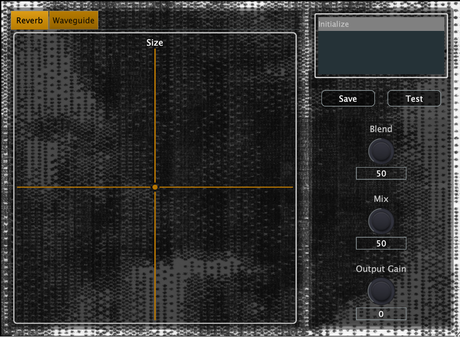

## WaveVerb - Hybrid Waveguide Network Reverb

Final project for MUMT618 seminar, McGill University Fall 2024. Description and demonstration are available [here](https://colinraab.github.io/waveverb/)

Feel free to check out my other projects on [my website](https://colinraab.com/)
